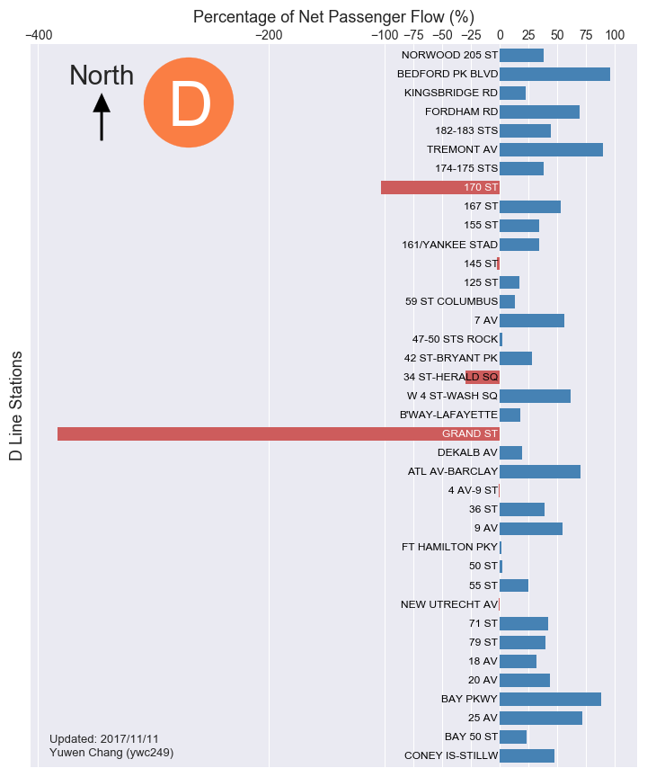

# README for HW 8

### Yuwen Chang (ywc249)

### Figure 1. Net Passenger Flows on D Line from 10/22 through 10/28
- The bar plot shows the net passenger flow for each station on the D line of NYC Subway based on turstile data of the week.
- The flow is transformed into percentage based on entries.

$$
\frac{(Entries - Exits)}{Entries} \times 100\%
$$

- 0% means entries equal to exits.
- A negative percentage means more people exit from the station than enter the station.
- Grand St. station is a constant outlier despite which week of the data is adopted.

## Objectives
1. Visualize and communicate analysis result.
2. Plot the net passenger flow by percentage for each station on the D line with a horizontal bar plot.

## Next Update

### Data
- The order of two stations is to be adjusted: '161/YANKEE STAD', '155 ST'
- Late night stations are to be included:'Union St', 'Prospect Ave', '25th St'
- Separate transfer stations\* are to be included: '5 AVE', 'BLEECKER ST'
- The percentages are to be adjusted, as many people do not exit the station through turnstiles.

### Visualization
- Plot the same data on a map, with circle size and color indicating the net flow percentage
- Pros: Allows geographically contextualized understanding of entry/exit flows.
- Cons: Not suitable for making comparisons.

**\*NOTE**: Separate transfer stations are not on D line, but are connected to a D station without having to pass a turnstile.

## Work collaboration
### HW 8
- Worked independently.